# ProArq Mobile App — Execution Plan

**Plan ID:** mobile-app-plan.md
**Based on:** `.opencode/plans/mobile-app.spec.md`
**Architecture:** React Native (Expo) → Web target | Clean Architecture alignment
**Runtime:** Bun v1.x
**Date:** 2026-05-24

---

## Table of Contents

1. Architecture Overview
2. Key Decisions vs Spec Deviations
3. Data Model (Local IndexedDB ERD)
4. Security Strategy
5. Component Tree & Screen Hierarchy
6. Expo Router Route Design
7. Data Flow (Online/Offline/Sync)
8. IndexedDB Schema (Dexie.js)
9. API Integration Layer
10. Implementation Phases (11 Phases)
11. File Manifest & Creation Sequence
12. Dependencies & Package Installation
13. Testing Strategy
14. Risk Mitigation
15. User Approval

---

## 1. Architecture Overview

### Layer Architecture

```
┌─────────────────────────────────────────────────────────────────────────┐
│                        apps/mobile (Expo Web App)                        │
│                                                                          │
│  ┌──────────────────────────────────────────────────────────────────┐   │
│  │  UI Layer (Screens + Components)                                 │   │
│  │  ┌─────────────────────┐  ┌──────────────────────────────────┐   │   │
│  │  │  Expo Router Pages   │  │  Reusable Components              │   │   │
│  │  │  (src/app/)          │  │  (src/components/)                │   │   │
│  │  │  - 18 screen files   │  │  - ui/ (Button, Card, Input...)   │   │   │
│  │  │  - Role-based gates  │  │  - layout/ (Header, BottomNav...) │   │   │
│  │  │  - File-based routes │  │  - domain/ (InsumoCard, ...)      │   │   │
│  │  └─────────────────────┘  └──────────────────────────────────┘   │   │
│  └──────────────────────────────────────────────────────────────────┘   │
│                                  │                                       │
│  ┌──────────────────────────────────────────────────────────────────┐   │
│  │  State Management Layer                                         │   │
│  │  ┌─────────────────────┐  ┌──────────────────────────────────┐   │   │
│  │  │  Zustand Stores      │  │  TanStack React Query            │   │   │
│  │  │  (Global app state)  │  │  (Server state cache)            │   │   │
│  │  │  - auth, sync        │  │  - GET cache + auto-refetch      │   │   │
│  │  │  - insumos, apus,    │  │  - Mutations with offline queue  │   │   │
│  │  │    cotizaciones       │  │  - Optimistic updates            │   │   │
│  │  └─────────────────────┘  └──────────────────────────────────┘   │   │
│  └──────────────────────────────────────────────────────────────────┘   │
│                                  │                                       │
│  ┌──────────────────────────────────────────────────────────────────┐   │
│  │  Service Layer                                                  │   │
│  │  ┌──────────────┐  ┌────────────────┐  ┌────────────────────┐   │   │
│  │  │  API Client   │  │  Sync Engine    │  │  Storage Services  │   │   │
│  │  │  (Axios +     │  │  - sync.service │  │  - Dexie/IndexedDB │   │   │
│  │  │   interceptors)│  │  - sync-queue   │  │  - auth-storage    │   │   │
│  │  │  - auth.api   │  │  - conflict-    │  │  - cache.service   │   │   │
│  │  │  - insumos    │  │    resolver     │  │                    │   │   │
│  │  │  - apus       │  └────────────────┘  └────────────────────┘   │   │
│  │  │  - cotizaciones│                                              │   │   │
│  │  │  - users      │                                               │   │   │
│  │  │  - projects   │                                               │   │   │
│  │  └──────────────┘                                                │   │   │
│  └──────────────────────────────────────────────────────────────────┘   │
│                                  │                                       │
│  ┌──────────────────────────────────────────────────────────────────┐   │
│  │  Shared Domain (packages/core)                                   │   │
│  │  - Entity types: User, Insumo, Apu, Cotizacion, Proyecto, etc.  │   │   │
│  │  - Zod schemas for validation (reused from backend)              │   │   │
│  │  - Error types: AppError, ForbiddenError, etc.                   │   │   │
│  └──────────────────────────────────────────────────────────────────┘   │
└─────────────────────────────────────────────────────────────────────────┘
```

### Data Flow Layers

```
┌────────────┐   ┌────────────┐   ┌────────────┐   ┌────────────┐   ┌─────────────┐
│  Expo Router│──▶│  Screen/    │──▶│  Hook      │──▶│  API       │──▶│  Backend    │
│  Pages      │   │  Component  │   │  (useQuery)│   │  Service   │   │  Express    │
│  (app/*.tsx)│   │             │   │            │   │  (Axios)   │   │  (REST)     │
└────────────┘   └──────┬──────┘   └──────┬─────┘   └──────┬─────┘   └─────────────┘
                        │                 │                │
                        │          ┌──────┴──────┐  ┌──────┴──────┐
                        │          │  Zustand     │  │  Dexie.js   │
                        │          │  Store       │  │  IndexedDB  │
                        │          │ (Auth/Sync)  │  │  (Offline)  │
                        │          └─────────────┘  └──────┬──────┘
                        │                                   │
                        └───────────────────────────────────┘
                              React Query reads cache first,
                              then background refreshes from API
```

---

## 2. Key Decisions vs Spec Deviations

| # | Spec Says | Plan Decides | Rationale |
|---|---|---|---|
| D-M-03 | SQLite (`expo-sqlite`) | **IndexedDB via Dexie.js** | Web target — `expo-sqlite` uses native SQLite, not available in browser. IndexedDB is the web-native offline store. Dexie.js provides a clean promise-based API. |
| D-M-07 | `react-native-pdf` | **Browser `<iframe>`** | Web target — `<iframe>` pointing to the backend PDF endpoint is simpler and more reliable than RN PDF libraries in browser. |
| D-M-08 | New `packages/mobile-core` | **Reuse `packages/core` directly** | All entity types and Zod schemas already exist in `packages/core`. No need for another shared package. Mobile imports from `@proarq/core`. |
| D-M-05 | `expo-web-browser` for PDF | **Native `<iframe>` / `window.open()`** | `expo-web-browser` is for opening URLs in system browser — not needed for in-app PDF. Use direct `<iframe>` or native `window.open()` for download fallback. |
| Auth | — | **Refresh token rotation** | Backend already has `auth-refresh.use-case.ts` with `refreshSchema`. Mobile uses the `/auth/refresh` endpoint with a dedicated Axios interceptor. |
| Pending mutations | SQLite table | **IndexedDB `sync_queue` table via Dexie** | Systematically stored as Dexie entities. Queue processed by sync service when online. |

---

## 3. Data Model (Local IndexedDB ERD)

### Mermaid ERD — Offline Data Model

```mermaid
erDiagram
    sync_queue_items {
        string id PK "UUID v4"
        string entity "insumo | apu | cotizacion | apu_insumo | cotizacion_item | project | user"
        string action "create | update | delete"
        object payload "Record<string, unknown>"
        string entityId "pre-generated UUID"
        string createdAt "ISO timestamp"
        int retryCount "default 0"
        string status "pending | syncing | failed"
        string errorMessage "nullable"
    }

    cached_insumos {
        string id PK "matches backend UUID"
        string codigo "UNIQUE"
        string nombre
        string unidad "M3 | KG | UND | GL"
        string costBase "decimal string"
        string createdBy
        string createdAt "ISO timestamp"
        string updatedAt "ISO timestamp"
        number _lastSyncedAt "epoch ms"
    }

    cached_apus {
        string id PK "matches backend UUID"
        string codigo "UNIQUE"
        string nombre
        string tipo
        string createdBy
        string createdAt "ISO timestamp"
        string updatedAt "ISO timestamp"
        number _lastSyncedAt "epoch ms"
    }

    cached_apu_insumos {
        string id PK
        string apuId FK
        string insumoId FK
        string rendimiento "decimal string"
        string desperdicio "decimal string"
        string unitPriceSnapshot "decimal string"
        string insumoNombre "denormalized for display"
        string insumoUnidad "denormalized"
        string createdAt "ISO timestamp"
        number _lastSyncedAt "epoch ms"
    }

    cached_cotizaciones {
        string id PK "matches backend UUID"
        string projectoId
        string codigo
        int version
        string estado "BORRADOR | ENVIADA | APROBADA | REEMPLAZADA"
        string clienteId "nullable"
        string totalCostDirect "decimal"
        string factorAPercentage "decimal"
        string factorBPercentage "decimal"
        string profitMarginPercent "decimal"
        string totalAmount "decimal"
        string createdBy
        string proyectoNombre "denormalized"
        string clienteNombre "denormalized"
        string createdAt "ISO timestamp"
        string updatedAt "ISO timestamp"
        number _lastSyncedAt "epoch ms"
    }

    cached_cotizacion_items {
        string id PK
        string cotizacionId FK
        string apuId
        string cantidad "decimal"
        string calculatedCostDirect "decimal"
        string apuCodigo "denormalized"
        string apuNombre "denormalized"
        string createdAt "ISO timestamp"
        number _lastSyncedAt "epoch ms"
    }

    cached_proyectos {
        string id PK
        string codigo
        string nombre
        string descripcion "nullable"
        string estado
        string clienteId "nullable"
        string clienteNombre "denormalized"
        string createdAt "ISO timestamp"
        string updatedAt "ISO timestamp"
        number _lastSyncedAt "epoch ms"
    }

    cached_users {
        string id PK
        string name
        string email
        string role
        string createdAt "ISO timestamp"
        string updatedAt "ISO timestamp"
        number _lastSyncedAt "epoch ms"
    }

    cached_audit_logs {
        string id PK
        string tableName
        string recordId
        string action
        string userId
        object dataHistory
        string createdAt "ISO timestamp"
        number _lastSyncedAt "epoch ms"
    }

    cached_apus ||--o{ cached_apu_insumos : "has"
    cached_cotizaciones ||--o{ cached_cotizacion_items : "contains"
    cached_insumos ||--o{ cached_apu_insumos : "referenced_in"
```



### Entity Relationship Summary

| Local Store | Backend Table | Sync Direction | TTL |
|---|---|---|---|
| `cached_insumos` | `insumos_maestro` | Bidirectional | 24h |
| `cached_apus` | `apus` | Bidirectional | 24h |
| `cached_apu_insumos` | `apu_insumos` | Bidirectional | 24h |
| `cached_cotizaciones` | `cotizaciones` | Bidirectional | 12h |
| `cached_cotizacion_items` | `cotizacion_items` | Bidirectional | 12h |
| `cached_proyectos` | `proyectos` | Backend → Local | 24h |
| `cached_users` | `users` | Backend → Local | 10min |
| `cached_audit_logs` | `audit_logs` | Backend → Local (ADMIN only) | No cache |
| `sync_queue_items` | (local only) | N/A | Cleared on sync |

---

## 4. Security Strategy

### JWT Token Architecture

```
┌────────────────────────────────────────────────────────────────┐
│                    Token Management Flow                         │
│                                                                  │
│  Login ──▶ { accessToken (7d), refreshToken (30d) }             │
│                │                              │                  │
│                ▼                              ▼                  │
│       Axios Interceptor              Secure Storage              │
│       (Authorization header)         (sessionStorage for web)    │
│                │                              │                  │
│  On 401 response ◀────────────────────────────┘                  │
│       │                                                          │
│       ▼                                                          │
│  Queue failed requests (promise-based dedup)                     │
│       │                                                          │
│       ▼                                                          │
│  POST /auth/refresh { refreshToken }                             │
│       │                                                          │
│       ├── Success → Rotate tokens, retry all queued requests     │
│       └── Failure → Clear storage, redirect to Login             │
└────────────────────────────────────────────────────────────────┘
```

### Security Implementation Details

| Layer | Implementation | Location |
|---|---|---|
| **Token Storage** | `sessionStorage` (web-appropriate, cleared on tab close). Falls back to in-memory if storage unavailable. | `services/storage/auth-storage.ts` |
| **Auth Header** | Axios request interceptor: attaches `Authorization: Bearer <token>` | `services/api/client.ts` |
| **Token Refresh** | Axios response interceptor: catches 401, queues simultaneous requests, calls refresh endpoint, replays queue | `services/api/client.ts` |
| **Auto-Logout** | On refresh failure (invalid/expired refresh token), clears all auth state → redirects to login | `services/auth/auth.service.ts` |
| **RBAC Enforcement** | Front-end role gates: `useRoleGuard()` hook checks `user.role` before rendering screens. Never route to admin screens for CLIENTE/REPRESENTANTE. | `hooks/useRoleGuard.ts` + route layout gates |
| **Input Validation** | Zod schemas from `@proarq/core` on all form submissions. Client-side validation before API call. | `utils/validators.ts` + React Hook Form |
| **XSS Prevention** | React's built-in escaping. No `dangerouslySetInnerHTML`. | Enforced by lint rules |
| **CORS** | Backend `CORS_ORIGIN` includes the Expo dev URL (`http://localhost:8081`) | Backend `env.ts` |
| **API Key Exposure** | No hardcoded secrets in client code. JWT only auth mechanism. | `config/api.config.ts` |

### RBAC Screen Mapping

```typescript
const ROLE_SCREEN_MAP: Record<string, string[]> = {
  ADMIN:           ['dashboard', 'insumos', 'apus', 'cotizaciones', 'users', 'link-client', 'audit-logs', 'profile'],
  GERENTE_OBRA:    ['dashboard', 'insumos-read', 'apus', 'cotizaciones', 'profile'],
  DIRECTOR_OBRA:   ['dashboard', 'insumos-read', 'apus', 'cotizaciones', 'profile'],
  CLIENTE:         ['client-portal', 'quote-detail', 'profile'],
  REPRESENTANTE:   ['client-portal', 'quote-detail', 'profile'],
};
```

---

## 5. Component Tree & Screen Hierarchy

```
<App>  (_layout.tsx)
├── <AuthGate>  (checks tokens, redirects accordingly)
│   ├── <AuthLayout>  ((auth)/_layout.tsx)
│   │   ├── LoginScreen       (login.tsx)       — S-01
│   │   ├── ForgotPassword    (forgot-password.tsx) — S-02
│   │   └── VerifyCode        (verify-code.tsx)  — S-03
│   │
│   ├── <RoleRouter>  (determines which tab layout to show)
│   │   ├── <TabLayout>  ((tabs)/_layout.tsx)
│   │   │   ├── BottomNav  (tab bar with role-aware items)
│   │   │   ├── DashboardTab       (dashboard.tsx)     — S-04
│   │   │   ├── InsumosTab         (insumos.tsx)        — S-08
│   │   │   ├── ApusTab            (apus.tsx)           — S-09 (list)
│   │   │   ├── CotizacionesTab    (cotizaciones.tsx)   — S-13 (history)
│   │   │   └── UsersTab           (users.tsx)          — S-05 (ADMIN only)
│   │   │
│   │   ├── <Stack Screens>  (pushed on top of tabs)
│   │   │   ├── ProfileScreen        (profile.tsx)           — S-07
│   │   │   ├── AccessDenied         (access-denied.tsx)     — S-18
│   │   │   ├── UserCreate           (users/create.tsx)      — S-06
│   │   │   ├── UserEdit             (users/[id].tsx)        — S-06
│   │   │   ├── ApuDetail            (apus/[id].tsx)         — S-09
│   │   │   ├── ApuCreate            (apus/create.tsx)       — S-09
│   │   │   ├── InsumoCreate         (insumos/create.tsx)    — S-08a
│   │   │   ├── InsumoEdit           (insumos/[id].tsx)      — S-08a
│   │   │   ├── QuoteCreate          (cotizaciones/create.tsx) — S-10
│   │   │   ├── QuoteDetail          (cotizaciones/[id].tsx) — S-14
│   │   │   ├── QuoteCompare         (cotizaciones/[id]/compare.tsx) — S-11
│   │   │   ├── QuotePdf             (cotizaciones/[id]/pdf.tsx)  — S-14
│   │   │   ├── ProjectDetail        (projects/[id].tsx)     — S-13 filter
│   │   │   └── LinkClient           (link-client.tsx)       — S-12
│   │   │
│   │   └── <ClientPortal>  (alternative root for CLIENTE/REPRESENTANTE)
│   │       └── ClientPortalScreen   (client-portal.tsx)      — S-15
│   │
│   └── <EmptyStates>
│       ├── EmptyQuotes      (S-16)
│       └── EmptyProjects    (S-17)
```

### Reusable Component Hierarchy

```
src/components/
├── ui/                          # Design system primitives
│   ├── Button.tsx               # Primary (Orange), Secondary (Navy), Ghost
│   ├── Card.tsx                 # No-line sectioning, bg shift
│   ├── Input.tsx                # Ghost border, focus bottom-border
│   ├── Badge.tsx                # Role badges, status badges
│   ├── Table.tsx                # Zebra striping, all-caps headers
│   ├── SearchBar.tsx            # With filter chips
│   ├── FilterChip.tsx           # Toggleable chip
│   ├── EmptyState.tsx           # Icon + heading + subtext + CTA
│   ├── LoadingState.tsx         # Skeleton/spinner
│   └── ErrorState.tsx           # Error message + retry
│
├── layout/                      # Layout components
│   ├── Header.tsx               # App name + profile avatar
│   ├── BottomNav.tsx            # Role-aware tab bar
│   ├── OfflineBanner.tsx        # "Modo sin conexión" banner
│   └── SyncStatusBadge.tsx      # Pending sync count
│
└── domain/                      # Domain-specific components
    ├── InsumoCard.tsx           # Código | Nombre | Unidad | Costo
    ├── ApuCard.tsx              # APU summary card
    ├── QuoteCard.tsx            # Quote list card
    ├── QuoteStatusBadge.tsx     # Color-coded status
    ├── CostSummary.tsx          # Financial breakdown footer
    └── VersionDiff.tsx          # Side-by-side version diff
```

---

## 6. Expo Router Route Design

```
apps/mobile/src/app/
│
├── _layout.tsx                  # Root layout: providers (QueryClient, AuthGate)
│                                  Wraps everything in:
│                                  - <QueryClientProvider>
│                                  - <AuthGate> (token check → redirect)
│
├── (auth)/                      # Unauthenticated route group
│   ├── _layout.tsx              # Auth layout: redirects to tabs if authenticated
│   ├── login.tsx                # S-01
│   ├── forgot-password.tsx      # S-02
│   └── verify-code.tsx          # S-03
│
├── (tabs)/                      # Authenticated tab route group (internal roles)
│   ├── _layout.tsx              # Tab navigator config + role gate
│   ├── dashboard.tsx            # S-04
│   ├── insumos.tsx              # S-08
│   ├── apus.tsx                 # S-09 (list)
│   ├── cotizaciones.tsx         # S-13
│   └── users.tsx                # S-05 (ADMIN only — gate inside)
│
├── (client)/                    # Client portal route group
│   ├── _layout.tsx              # Client layout: only CLIENTE/REPRESENTANTE
│   └── index.tsx                # S-15 Client Portal (redirect from /)
│
├── profile.tsx                  # S-07 Edit Profile
├── access-denied.tsx            # S-18 Access Denied
├── link-client.tsx              # S-12 Link Client to Projects (ADMIN)
│
├── users/                       # Admin user management
│   ├── create.tsx               # S-06 Create User
│   └── [id].tsx                 # S-06 Edit User
│
├── insumos/                     # Insumo CRUD
│   ├── create.tsx               # S-08a Create (ADMIN)
│   └── [id].tsx                 # S-08a Edit (ADMIN)
│
├── apus/                        # APU detail & creation
│   ├── create.tsx               # S-09 Create
│   └── [id].tsx                 # S-09 Detail/Edit
│
├── cotizaciones/                # Quote screens
│   ├── create.tsx               # S-10 Quote Creator
│   ├── [id].tsx                 # S-14 Quote Detail
│   └── [id]/
│       ├── compare.tsx          # S-11 Version Compare
│       └── pdf.tsx              # S-14 PDF Viewer
│
└── projects/
    └── [id].tsx                 # S-13 filtered by project
```

### Route Param Types

```typescript
// types/navigation.ts
export type RouteParams = {
  'users/[id]': { id: string };
  'insumos/[id]': { id: string };
  'apus/[id]': { id: string };
  'apus/create': { insumoId?: string };
  'cotizaciones/[id]': { id: string };
  'cotizaciones/create': { projectId?: string };
  'cotizaciones/[id]/compare': { id: string; v1?: string; v2?: string };
  'cotizaciones/[id]/pdf': { id: string };
  'projects/[id]': { id: string };
};
```

---

## 7. Data Flow (Online/Offline/Sync)

### Online Mode

```
User Action → Screen Component → Hook (useQuery/useMutation) → API Service
                                                                │
                                                    ┌───────────┴───────────┐
                                                    │                      │
                                                    ▼                      ▼
                                              Axios Request        Dexie Cache
                                              → Backend API        (write-through)
                                                    │
                                                    ▼
                                              Response → React Query cache
                                                    │
                                                    ▼
                                              Re-render component
```

### Offline Mode

```
User Action → Screen Component
                    │
            ┌───────┴───────┐
            │               │
            ▼               ▼
      READ operation   WRITE operation
            │               │
            ▼               ▼
      Dexie Cache      Generate UUID (crypto.randomUUID())
      (cached_*)              │
            │               ▼
            ▼          Apply locally:
      Render from      Dexie.insert()
      cached data      Zustand.update()
            │               │
            ▼               ▼
      "Modo sin       Enqueue to
      conexión"       sync_queue_items
      banner                │
                           ▼
                     Show optimistic
                     state + pending badge
```

### Sync Flow

```
┌─────────────────────────────────────────────────────────────────────┐
│                        Sync Orchestration                            │
│                                                                      │
│  Trigger: Connectivity restored OR Pull-to-refresh OR Manual sync   │
│           (debounced 5 seconds after reconnection)                   │
│                                                                      │
│  1. Read all sync_queue_items WHERE status='pending'                 │
│     Ordered by createdAt ASC                                         │
│                                                                      │
│  2. Batch them into a syncPayload:                                  │
│     { insumos: [...], apus: [...], cotizaciones: [...],             │
│       apuInsumos: [...], cotizacionItems: [...] }                    │
│                                                                      │
│  3. POST /api/v1/sincronizar with payload                           │
│                                                                      │
│  4. On success →                                                    │
│     { accepted: number, conflicts: number }                          │
│     - Mark accepted items as status='synced' or delete from queue   │
│     - Re-fetch all cached data from API (GET fresh state)           │
│     - Show "Sincronización completa" toast                          │
│                                                                      │
│  5. On conflict →                                                    │
│     - Log for manual resolution                                      │
│     - Mark as 'failed' with errorMessage                             │
│                                                                      │
│  6. On error →                                                       │
│     - Exponential backoff: retryCount++, max 3 retries              │
│     - After max retries: mark as 'failed' with errorMessage         │
└─────────────────────────────────────────────────────────────────────┘
```

### Query Strategy (React Query)

```typescript
// All queries follow this pattern:
function useInsumos(search?: InsumoQuery) {
  return useQuery({
    queryKey: ['insumos', search],
    queryFn: () => insumosApi.list(search),

    // Write-through cache: Always write to Dexie on successful fetch
    // This ensures offline availability
    onSuccess: (data) => dexie.insumos.bulkPut(data.data),

    // Initial data from local cache while loading
    placeholderData: () => dexie.insumos.toArray(),

    staleTime: 1000 * 60 * 5,  // 5 min
    gcTime: 1000 * 60 * 60,    // 1 hour
  });
}
```

---

## 8. IndexedDB Schema (Dexie.js)

### Database Versioning & Schema

```typescript
// services/storage/database.ts
import Dexie, { type Table } from 'dexie';

// Types mirroring @proarq/core entities but with local metadata
export interface CachedInsumo {
  id: string;
  codigo: string;
  nombre: string;
  unidad: 'M3' | 'KG' | 'UND' | 'GL';
  costBase: string;
  createdBy: string;
  createdAt: string;
  updatedAt: string;
  _lastSyncedAt: number; // local metadata — epoch ms
}

export interface CachedApu {
  id: string;
  codigo: string;
  nombre: string;
  tipo: string;
  createdBy: string;
  createdAt: string;
  updatedAt: string;
  _lastSyncedAt: number;
}

export interface CachedApuInsumo {
  id: string;
  apuId: string;
  insumoId: string;
  rendimiento: string;
  desperdicio: string;
  unitPriceSnapshot: string;
  insumoNombre: string;
  insumoUnidad: string;
  createdAt: string;
  _lastSyncedAt: number;
}

export interface CachedCotizacion {
  id: string;
  projectoId: string;
  codigo: string;
  version: number;
  estado: string;
  clienteId?: string;
  totalCostDirect: string;
  factorAPercentage: string;
  factorBPercentage: string;
  profitMarginPercent: string;
  totalAmount: string;
  createdBy: string;
  proyectoNombre?: string;
  clienteNombre?: string;
  createdAt: string;
  updatedAt: string;
  _lastSyncedAt: number;
}

export interface CachedCotizacionItem {
  id: string;
  cotizacionId: string;
  apuId: string;
  cantidad: string;
  calculatedCostDirect: string;
  apuCodigo?: string;
  apuNombre?: string;
  createdAt: string;
  _lastSyncedAt: number;
}

export interface CachedProyecto {
  id: string;
  codigo: string;
  nombre: string;
  descripcion?: string;
  estado: string;
  clienteId?: string;
  clienteNombre?: string;
  createdAt: string;
  updatedAt: string;
  _lastSyncedAt: number;
}

export interface CachedUser {
  id: string;
  name: string;
  email: string;
  role: string;
  createdAt: string;
  updatedAt: string;
  _lastSyncedAt: number;
}

export interface SyncQueueItem {
  id: string;
  entity: 'insumo' | 'apu' | 'cotizacion' | 'apu_insumo' | 'cotizacion_item' | 'project' | 'user';
  action: 'create' | 'update' | 'delete';
  payload: Record<string, unknown>;
  entityId: string;
  createdAt: string;
  retryCount: number;
  status: 'pending' | 'syncing' | 'failed';
  errorMessage?: string;
}

export class ProArqDatabase extends Dexie {
  insumos!: Table<CachedInsumo, string>;
  apus!: Table<CachedApu, string>;
  apuInsumos!: Table<CachedApuInsumo, string>;
  cotizaciones!: Table<CachedCotizacion, string>;
  cotizacionItems!: Table<CachedCotizacionItem, string>;
  proyectos!: Table<CachedProyecto, string>;
  users!: Table<CachedUser, string>;
  syncQueue!: Table<SyncQueueItem, string>;

  constructor() {
    super('proarq');

    this.version(1).stores({
      insumos: 'id, codigo, nombre, unidad, _lastSyncedAt',
      apus: 'id, codigo, nombre, _lastSyncedAt',
      apuInsumos: 'id, apuId, insumoId, _lastSyncedAt',
      cotizaciones: 'id, codigo, estado, projectoId, version, _lastSyncedAt',
      cotizacionItems: 'id, cotizacionId, apuId, _lastSyncedAt',
      proyectos: 'id, codigo, nombre, estado, _lastSyncedAt',
      users: 'id, name, email, role, _lastSyncedAt',
      syncQueue: 'id, entity, status, createdAt',
    });
  }
}

export const db = new ProArqDatabase();
```

### IndexedDB Collection Purpose

| Dexie Table | Backend Mirror | Key-Indexed Fields | Query Pattern |
|---|---|---|---|
| `insumos` | `insumos_maestro` | `id, codigo, nombre, unidad` | `where('nombre').startsWith()` |
| `apus` | `apus` | `id, codigo, nombre` | `where('codigo').equals()` |
| `apuInsumos` | `apu_insumos` | `id, apuId, insumoId` | `where('apuId').equals()` |
| `cotizaciones` | `cotizaciones` | `id, estado, projectoId` | `where('projectoId').equals()` |
| `cotizacionItems` | `cotizacion_items` | `id, cotizacionId` | `where('cotizacionId').equals()` |
| `proyectos` | `proyectos` | `id, estado` | `where('estado').equals()` |
| `users` | `users` | `id, role` | `where('role').equals()` |
| `syncQueue` | (local only) | `id, entity, status` | `where('status').equals('pending')` |

---

## 9. API Integration Layer

### API Client Architecture

```typescript
// services/api/client.ts
import axios from 'axios';
import { API_BASE_URL, API_TIMEOUTS } from '../../config/api.config';
import { authStorage } from '../storage/auth-storage';
import { authApi } from './auth.api';

const client = axios.create({
  baseURL: API_BASE_URL,       // http://localhost:8000/api/v1
  timeout: API_TIMEOUTS.READ,  // 10s reads, 15s writes
  headers: { 'Content-Type': 'application/json' },
});

// === Request interceptor: attach JWT ===
client.interceptors.request.use(async (config) => {
  const token = await authStorage.getAccessToken();
  if (token) {
    config.headers.Authorization = `Bearer ${token}`;
  }
  return config;
});

// === Response interceptor: handle 401 with refresh ===
let isRefreshing = false;
let failedQueue: Array<{ resolve: Function; reject: Function }> = [];

const processQueue = (error: unknown, token: string | null = null) => {
  failedQueue.forEach(({ resolve, reject }) => {
    if (error) reject(error);
    else resolve(token);
  });
  failedQueue = [];
};

client.interceptors.response.use(
  (response) => response,
  async (error) => {
    const originalRequest = error.config;

    if (error.response?.status === 401 && !originalRequest._retry) {
      if (isRefreshing) {
        // Queue this request while refresh is in progress
        return new Promise((resolve, reject) => {
          failedQueue.push({ resolve, reject });
        }).then((token) => {
          originalRequest.headers.Authorization = `Bearer ${token}`;
          return client(originalRequest);
        });
      }

      originalRequest._retry = true;
      isRefreshing = true;

      try {
        const refreshToken = await authStorage.getRefreshToken();
        if (!refreshToken) throw new Error('No refresh token');

        const { accessToken, refreshToken: newRefresh } = await authApi.refresh(refreshToken);
        await authStorage.setTokens(accessToken, newRefresh);

        processQueue(null, accessToken);
        originalRequest.headers.Authorization = `Bearer ${accessToken}`;
        return client(originalRequest);
      } catch (refreshError) {
        processQueue(refreshError, null);
        await authStorage.clearTokens();
        window.location.href = '/login'; // Force redirect
        return Promise.reject(refreshError);
      } finally {
        isRefreshing = false;
      }
    }

    return Promise.reject(error);
  },
);

export default client;
```

### Domain API Services

| Service | File | Key Methods |
|---|---|---|
| Auth | `services/api/auth.api.ts` | `login()`, `forgotPassword()`, `resetPassword()`, `refresh()` |
| Insumos | `services/api/insumos.api.ts` | `list()`, `getById()`, `create()`, `update()`, `delete()`, `bulkUpload()` |
| APUs | `services/api/apus.api.ts` | `list()`, `getById()`, `create()`, `update()`, `delete()`, `addInsumo()`, `removeInsumo()` |
| Cotizaciones | `services/api/cotizaciones.api.ts` | `list()`, `getById()`, `create()`, `update()`, `branch()`, `downloadPdf()` |
| Users | `services/api/users.api.ts` | `list()`, `getById()`, `create()`, `update()`, `delete()` |
| Projects | `services/api/projects.api.ts` | `list()`, `getById()` |
| Audit | `services/api/audit.api.ts` | `list()` |
| Sync | `services/api/sync.api.ts` | `sync()` |

Each service module follows this pattern:

```typescript
// services/api/insumos.api.ts example
import client from './client';
import type { Insumo } from '@proarq/core/domain/entities/insumo.entity';

export interface InsumoQuery {
  codigo?: string;
  nombre?: string;
  unidad?: string;
  page?: number;
  limit?: number;
}

export interface PaginatedResponse<T> {
  data: T[];
  total: number;
  page: number;
  limit: number;
  totalPages: number;
}

export const insumosApi = {
  list: async (query?: InsumoQuery): Promise<PaginatedResponse<Insumo>> => {
    const { data } = await client.get('/insumos', { params: query });
    return data;
  },

  getById: async (id: string): Promise<Insumo> => {
    const { data } = await client.get(`/insumos/${id}`);
    return data;
  },

  create: async (payload: Partial<Insumo>): Promise<Insumo> => {
    const { data } = await client.post('/insumos', payload);
    return data;
  },

  update: async (id: string, payload: Partial<Insumo>): Promise<Insumo> => {
    const { data } = await client.put(`/insumos/${id}`, payload);
    return data;
  },

  delete: async (id: string): Promise<void> => {
    await client.delete(`/insumos/${id}`);
  },
};
```

---

## 10. Implementation Phases (11 Phases)

### Phase 1: Foundation (6h)

**Goal:** Expo project bootstrapped, monorepo workspace wired, theme tokens defined, base UI components built, API client with auth interceptor.

**Dependencies:** None

| Step | Files to Create/Modify | Details |
|---|---|---|
| 1.1 Bootstrap Expo | `apps/mobile/package.json`, `apps/mobile/tsconfig.json`, `apps/mobile/app.json` | `npx create-expo-app@latest --template blank-typescript` then move into monorepo. Set `"web"` as default platform. |
| 1.2 Workspace config | `apps/mobile/package.json` | Set `"name": "@proarq/mobile"`, add `"main": "expo-router/entry"`, all dependencies |
| 1.3 Create theme tokens | `apps/mobile/src/theme/colors.ts`, `typography.ts`, `spacing.ts`, `shadows.ts`, `index.ts` | Exact color palette from spec. Typography scale with Inter font. All values from DESIGN.md. |
| 1.4 Create base UI components | `apps/mobile/src/components/ui/Button.tsx`, `Card.tsx`, `Input.tsx`, `Badge.tsx`, `Table.tsx` | Implement design tokens. Button: primary (Orange), secondary (Navy), ghost. Input: ghost border, 2px bottom-border on focus. |
| 1.5 Create API config | `apps/mobile/src/config/api.config.ts`, `env.ts` | `API_BASE_URL = 'http://localhost:8000/api/v1'`, timeout config |
| 1.6 Create Axios client | `apps/mobile/src/services/api/client.ts` | Request interceptor (JWT), response interceptor (401 refresh) |
| 1.7 Create auth storage | `apps/mobile/src/services/storage/auth-storage.ts` | sessionStorage wrapper for access + refresh tokens |
| 1.8 Install dependencies | Root `bun install` | Install all Expo + mobile deps |
| 1.9 Verify setup | Run `bun run --filter @proarq/mobile dev` | Ensure Expo web server starts on port 8081 |

### Phase 2: Auth + Navigation (6h)

**Goal:** Login, forgot password, verify code screens working. Expo Router setup with auth gate. Role-based routing.

**Dependencies:** Phase 1

| Step | Files to Create/Modify | Details |
|---|---|---|
| 2.1 Create root layout | `apps/mobile/src/app/_layout.tsx` | Wrap in `<QueryClientProvider>`, `<AuthGate>`, font loading |
| 2.2 Create auth layout | `apps/mobile/src/app/(auth)/_layout.tsx` | Redirect to tabs if already authenticated |
| 2.3 Create login screen | `apps/mobile/src/app/(auth)/login.tsx` | S-01: email + password + submit + forgot link |
| 2.4 Create forgot password | `apps/mobile/src/app/(auth)/forgot-password.tsx` | S-02: email input + send code button |
| 2.5 Create verify code | `apps/mobile/src/app/(auth)/verify-code.tsx` | S-03: OTP 6-digit + new password + confirm |
| 2.6 Create auth API service | `apps/mobile/src/services/api/auth.api.ts` | `login()`, `forgotPassword()`, `resetPassword()`, `refresh()` |
| 2.7 Create auth service | `apps/mobile/src/services/auth/auth.service.ts` | Login flow, token storage, auto-logout |
| 2.8 Create token manager | `apps/mobile/src/services/auth/token-manager.ts` | Token validation, expiry checks |
| 2.9 Create auth store | `apps/mobile/src/stores/auth.store.ts` | Zustand: `user`, `isAuthenticated`, `login()`, `logout()` |
| 2.10 Create useAuth hook | `apps/mobile/src/hooks/useAuth.ts` | Wraps auth store + React Query for user profile |
| 2.11 Create useOnline hook | `apps/mobile/src/hooks/useOnline.ts` | NetInfo listener, returns `isOnline: boolean` |

### Phase 3: Dashboard + Empty States (6h)

**Goal:** Dashboard screen with project stats, recent quotes. Empty state screens for no data. Access denied screen. Edit profile screen.

**Dependencies:** Phase 1, 2

| Step | Files to Create/Modify | Details |
|---|---|---|
| 3.1 Create tab layout | `apps/mobile/src/app/(tabs)/_layout.tsx` | Bottom tab navigator with role-aware items |
| 3.2 Create dashboard | `apps/mobile/src/app/(tabs)/dashboard.tsx` | S-04: stats cards, recent projects, quick action FAB |
| 3.3 Create empty state UI | `apps/mobile/src/components/ui/EmptyState.tsx` | Icon + heading + subtext + CTA |
| 3.4 Create loading state UI | `apps/mobile/src/components/ui/LoadingState.tsx` | Skeleton placeholders |
| 3.5 Create error state UI | `apps/mobile/src/components/ui/ErrorState.tsx` | Error message + retry button |
| 3.6 Create access denied screen | `apps/mobile/src/app/access-denied.tsx` | S-18: lock icon, message, "Volver al Inicio" |
| 3.7 Create client portal layout | `apps/mobile/src/app/(client)/_layout.tsx` | Role gate: only CLIENTE/REPRESENTANTE |
| 3.8 Create client portal | `apps/mobile/src/app/(client)/index.tsx` | S-15: welcome header, project list, quote cards |
| 3.9 Create profile screen | `apps/mobile/src/app/profile.tsx` | S-07: name, email, role badge, save |
| 3.10 Create header component | `apps/mobile/src/components/layout/Header.tsx` | App name + profile avatar → profile |
| 3.11 Create bottom nav | `apps/mobile/src/components/layout/BottomNav.tsx` | Tab bar icons + role-aware visibility |
| 3.12 Create offline banner | `apps/mobile/src/components/layout/OfflineBanner.tsx` | "Modo sin conexión" with last sync time |
| 3.13 Create useRoleGuard hook | `apps/mobile/src/hooks/useRoleGuard.ts` | Returns `canAccess(screen)`, `canEdit(module)` |
| 3.14 Create projects API service | `apps/mobile/src/services/api/projects.api.ts` | `list()`, `getById()` |
| 3.15 Create useProjects hook | `apps/mobile/src/hooks/useProjects.ts` | Wraps React Query + Dexie cache |

### Phase 4: Insumos Module (6h)

**Goal:** Insumos catalog screen with search, filter, pagination. Create/edit/delete for ADMIN. Offline read from cache.

**Dependencies:** Phase 1, 2, 3

| Step | Files to Create/Modify | Details |
|---|---|---|
| 4.1 Create tab screen | `apps/mobile/src/app/(tabs)/insumos.tsx` | S-08: search bar, filter chips, list, FAB (ADMIN) |
| 4.2 Create create insumo | `apps/mobile/src/app/insumos/create.tsx` | S-08a: form with validation |
| 4.3 Create edit insumo | `apps/mobile/src/app/insumos/[id].tsx` | S-08a: form pre-filled, save/delete |
| 4.4 Create InsumoCard | `apps/mobile/src/components/domain/InsumoCard.tsx` | Codigo, Nombre, Unidad, Costo Base |
| 4.5 Create SearchBar UI | `apps/mobile/src/components/ui/SearchBar.tsx` | Text input + search icon + clear |
| 4.6 Create FilterChip UI | `apps/mobile/src/components/ui/FilterChip.tsx` | Toggleable chip button |
| 4.7 Create insumos API service | `apps/mobile/src/services/api/insumos.api.ts` | `list()`, `getById()`, `create()`, `update()`, `delete()` |
| 4.8 Create useInsumos hook | `apps/mobile/src/hooks/useInsumos.ts` | React Query + Dexie cache |
| 4.9 Create insumos store | `apps/mobile/src/stores/insumos.store.ts` | Zustand: search filters, pagination |
| 4.10 Create Dexie database | `apps/mobile/src/services/storage/database.ts` | ProArqDatabase class with all tables |
| 4.11 Create cache service | `apps/mobile/src/services/storage/cache.service.ts` | Write-through helpers for each entity |
| 4.12 Create usePagination hook | `apps/mobile/src/hooks/usePagination.ts` | Page/limit state, load more |

### Phase 5: APU Module (8h)

**Goal:** APU creator with insumo search modal, item management, cost calculation, CRUD. Offline queue.

**Dependencies:** Phase 1, 2, 4

| Step | Files to Create/Modify | Details |
|---|---|---|
| 5.1 Create APU list tab | `apps/mobile/src/app/(tabs)/apus.tsx` | APU list screen with search |
| 5.2 Create APU creator | `apps/mobile/src/app/apus/create.tsx` | S-09: header fields, items list, add insumo |
| 5.3 Create APU detail/edit | `apps/mobile/src/app/apus/[id].tsx` | S-09: view/edit APU with items |
| 5.4 Create ApuCard | `apps/mobile/src/components/domain/ApuCard.tsx` | APU summary card |
| 5.5 Create CostSummary | `apps/mobile/src/components/domain/CostSummary.tsx` | Financial breakdown footer |
| 5.6 Create apus API service | `apps/mobile/src/services/api/apus.api.ts` | `list()`, `getById()`, `create()`, `update()`, `delete()`, `addInsumo()`, `removeInsumo()` |
| 5.7 Create useApus hook | `apps/mobile/src/hooks/useApus.ts` | React Query + Dexie |
| 5.8 Create apus store | `apps/mobile/src/stores/apus.store.ts` | Zustand: current APU state |
| 5.9 Create cost calculator | `apps/mobile/src/utils/cost-calculator.ts` | Client-side: APU item cost, total direct cost |
| 5.10 Add APU insumo modal | (inline in APU creator) | Search insumos, select, set rendimiento + desperdicio |
| 5.11 Create formatters | `apps/mobile/src/utils/formatters.ts` | Currency (COP), date, number with decimal precision |

### Phase 6: Quotes Module (10h)

**Goal:** Quote creator, quote history list, quote detail, PDF viewer (iframe), branching. Full offline support.

**Dependencies:** Phase 1, 2, 5

| Step | Files to Create/Modify | Details |
|---|---|---|
| 6.1 Create quote history | `apps/mobile/src/app/(tabs)/cotizaciones.tsx` | S-13: filter bar, search, list cards |
| 6.2 Create quote creator | `apps/mobile/src/app/cotizaciones/create.tsx` | S-10: project select, APU multi-select, quantity, factors |
| 6.3 Create quote detail | `apps/mobile/src/app/cotizaciones/[id].tsx` | S-14: header, items table, financial summary, actions |
| 6.4 Create PDF viewer | `apps/mobile/src/app/cotizaciones/[id]/pdf.tsx` | S-14: `<iframe>` pointing to backend PDF endpoint |
| 6.5 Create QuoteCard | `apps/mobile/src/components/domain/QuoteCard.tsx` | Quote list card with status badge |
| 6.6 Create QuoteStatusBadge | `apps/mobile/src/components/domain/QuoteStatusBadge.tsx` | Color-coded by estado |
| 6.7 Create cotizaciones API | `apps/mobile/src/services/api/cotizaciones.api.ts` | `list()`, `getById()`, `create()`, `update()`, `branch()`, `downloadPdf()` |
| 6.8 Create useCotizaciones hook | `apps/mobile/src/hooks/useCotizaciones.ts` | React Query + Dexie |
| 6.9 Create cotizaciones store | `apps/mobile/src/stores/cotizaciones.store.ts` | Zustand: filters, current quote |
| 6.10 Create roles utils | `apps/mobile/src/utils/role-utils.ts` | PDF access, action permissions |
| 6.11 Create validators | `apps/mobile/src/utils/validators.ts` | Zod schema wrappers from @proarq/core |

### Phase 7: Version Compare (4h)

**Goal:** Side-by-side version comparison with diff highlighting.

**Dependencies:** Phase 6

| Step | Files to Create/Modify | Details |
|---|---|---|
| 7.1 Create compare screen | `apps/mobile/src/app/cotizaciones/[id]/compare.tsx` | S-11: version selector, stacked diff view |
| 7.2 Create VersionDiff component | `apps/mobile/src/components/domain/VersionDiff.tsx` | Diff rendering: changed fields highlighted |
| 7.3 Add version fetching logic | `services/api/cotizaciones.api.ts` (modify) | Fetch multiple versions for comparison |

### Phase 8: Users Module (ADMIN) (6h)

**Goal:** User directory, create/edit user, link client to projects. ADMIN-only screens.

**Dependencies:** Phase 1, 2

| Step | Files to Create/Modify | Details |
|---|---|---|
| 8.1 Create user directory tab | `apps/mobile/src/app/(tabs)/users.tsx` | S-05: search, filter, list, FAB, swipe-delete |
| 8.2 Create user create | `apps/mobile/src/app/users/create.tsx` | S-06: form with role dropdown |
| 8.3 Create user edit | `apps/mobile/src/app/users/[id].tsx` | S-06: edit form |
| 8.4 Create link client screen | `apps/mobile/src/app/link-client.tsx` | S-12: client select + project multi-select |
| 8.5 Create users API service | `apps/mobile/src/services/api/users.api.ts` | `list()`, `getById()`, `create()`, `update()`, `delete()` |
| 8.6 Create useUsers hook | `apps/mobile/src/hooks/useUsers.ts` | React Query + Dexie |

### Phase 9: Sync Engine (8h)

**Goal:** Offline queue management, sync orchestration, conflict resolution, connectivity detection.

**Dependencies:** Phase 4, 5, 6

| Step | Files to Create/Modify | Details |
|---|---|---|
| 9.1 Create sync queue | `apps/mobile/src/services/sync/sync-queue.ts` | Dexie-based queue operations: `enqueue()`, `dequeue()`, `markSynced()`, `markFailed()` |
| 9.2 Create sync service | `apps/mobile/src/services/sync/sync.service.ts` | Orchestrator: check online → read queue → batch payload → POST → handle response |
| 9.3 Create conflict resolver | `apps/mobile/src/services/sync/conflict-resolver.ts` | Handle sync response conflicts, surface to UI |
| 9.4 Create sync API service | `apps/mobile/src/services/api/sync.api.ts` | `sync(payload)` → POST `/sincronizar` |
| 9.5 Create sync store | `apps/mobile/src/stores/sync.store.ts` | Zustand: `isSyncing`, `pendingCount`, `lastSyncAt`, `failedItems` |
| 9.6 Create useSync hook | `apps/mobile/src/hooks/useSync.ts` | Trigger sync, monitor status |
| 9.7 Create SyncStatusBadge | `apps/mobile/src/components/layout/SyncStatusBadge.tsx` | Pending sync count badge |
| 9.8 Wire into root layout | `_layout.tsx` (modify) | Add sync listener on connectivity change |
| 9.9 Create UUID util | `apps/mobile/src/utils/uuid.ts` | `crypto.randomUUID()` wrapper |

### Phase 10: Client Portal (4h)

**Goal:** Client-facing portal with project-scoped quotes, redacted PDF.

**Dependencies:** Phase 1, 2, 6

| Step | Files to Create/Modify | Details |
|---|---|---|
| 10.1 Client portal (refine) | `apps/mobile/src/app/(client)/index.tsx` (modify) | S-15: enhanced with quote detail navigation |
| 10.2 Client quote detail | `apps/mobile/src/app/cotizaciones/[id].tsx` (role-gate) | Redacted view: totals only, no APU breakdown |
| 10.3 Client PDF view | `apps/mobile/src/app/cotizaciones/[id]/pdf.tsx` (role-gate) | Redacted PDF via iframe |
| 10.4 Project detail screen | `apps/mobile/src/app/projects/[id].tsx` | Quotes filtered by project |

### Phase 11: Polish + Edge Cases (6h)

**Goal:** Design system refinement, loading/error states, animations, accessibility audit, Biome cleanup.

**Dependencies:** All phases

| Step | Files to Create/Modify | Details |
|---|---|---|
| 11.1 Accessibility audit | All screen files | Add `accessibilityLabel`, `role`, `aria-*` attributes |
| 11.2 Add remaining UI components | `SearchBar.tsx`, `FilterChip.tsx` (finalize) | Ensure all design tokens applied |
| 11.3 Audit log viewer | (if needed, deferred) | Basic admin log viewer |
| 11.4 Create audit API | `services/api/audit.api.ts` | `list()` |
| 11.5 Accessibility refinement | All components | Focus indicators, screen reader support |
| 11.6 Empty state wiring | S-16, S-17 integrated | All list screens show empty state when no data |
| 11.7 Error boundaries | Root `_layout.tsx` | Route-level error boundaries |
| 11.8 Biome lint pass | All files | `bun run lint --filter @proarq/mobile` — fix all errors |
| 11.9 Animations (optional) | Selected components | Reanimated transitions for route changes |

---

## 11. File Manifest & Creation Sequence

### Total: ~85 files across 11 phases

```
apps/mobile/
├── package.json                          # Phase 1
├── tsconfig.json                         # Phase 1
├── app.json                              # Phase 1
├── babel.config.js                       # Phase 1
├── metro.config.js                       # Phase 1
│
└── src/
    ├── app/                              # Expo Router pages (23 files)
    │   ├── _layout.tsx                   # Phase 2
    │   ├── (auth)/
    │   │   ├── _layout.tsx               # Phase 2
    │   │   ├── login.tsx                 # Phase 2
    │   │   ├── forgot-password.tsx       # Phase 2
    │   │   └── verify-code.tsx           # Phase 2
    │   ├── (tabs)/
    │   │   ├── _layout.tsx               # Phase 3
    │   │   ├── dashboard.tsx             # Phase 3
    │   │   ├── insumos.tsx               # Phase 4
    │   │   ├── apus.tsx                  # Phase 5
    │   │   ├── cotizaciones.tsx          # Phase 6
    │   │   └── users.tsx                 # Phase 8
    │   ├── (client)/
    │   │   ├── _layout.tsx               # Phase 3
    │   │   └── index.tsx                 # Phase 3
    │   ├── profile.tsx                   # Phase 3
    │   ├── access-denied.tsx             # Phase 3
    │   ├── link-client.tsx               # Phase 8
    │   ├── users/
    │   │   ├── create.tsx                # Phase 8
    │   │   └── [id].tsx                  # Phase 8
    │   ├── insumos/
    │   │   ├── create.tsx                # Phase 4
    │   │   └── [id].tsx                  # Phase 4
    │   ├── apus/
    │   │   ├── create.tsx                # Phase 5
    │   │   └── [id].tsx                  # Phase 5
    │   ├── cotizaciones/
    │   │   ├── create.tsx                # Phase 6
    │   │   ├── [id].tsx                  # Phase 6
    │   │   └── [id]/
    │   │       ├── compare.tsx           # Phase 7
    │   │       └── pdf.tsx               # Phase 6
    │   └── projects/
    │       └── [id].tsx                  # Phase 10
    │
    ├── components/                       # Reusable components (19 files)
    │   ├── ui/
    │   │   ├── Button.tsx                # Phase 1
    │   │   ├── Card.tsx                  # Phase 1
    │   │   ├── Input.tsx                 # Phase 1
    │   │   ├── Badge.tsx                 # Phase 1
    │   │   ├── Table.tsx                 # Phase 1
    │   │   ├── SearchBar.tsx             # Phase 4
    │   │   ├── FilterChip.tsx            # Phase 4
    │   │   ├── EmptyState.tsx            # Phase 3
    │   │   ├── LoadingState.tsx          # Phase 3
    │   │   └── ErrorState.tsx            # Phase 3
    │   ├── layout/
    │   │   ├── Header.tsx                # Phase 3
    │   │   ├── BottomNav.tsx             # Phase 3
    │   │   ├── OfflineBanner.tsx         # Phase 3
    │   │   └── SyncStatusBadge.tsx       # Phase 9
    │   └── domain/
    │       ├── InsumoCard.tsx            # Phase 4
    │       ├── ApuCard.tsx               # Phase 5
    │       ├── QuoteCard.tsx             # Phase 6
    │       ├── QuoteStatusBadge.tsx      # Phase 6
    │       ├── CostSummary.tsx           # Phase 5
    │       └── VersionDiff.tsx           # Phase 7
    │
    ├── services/                         # Service layer (19 files)
    │   ├── api/
    │   │   ├── client.ts                 # Phase 1
    │   │   ├── auth.api.ts               # Phase 2
    │   │   ├── insumos.api.ts            # Phase 4
    │   │   ├── apus.api.ts               # Phase 5
    │   │   ├── cotizaciones.api.ts       # Phase 6
    │   │   ├── users.api.ts              # Phase 8
    │   │   ├── projects.api.ts           # Phase 3
    │   │   ├── audit.api.ts              # Phase 11
    │   │   └── sync.api.ts               # Phase 9
    │   ├── sync/
    │   │   ├── sync.service.ts           # Phase 9
    │   │   ├── sync-queue.ts             # Phase 9
    │   │   └── conflict-resolver.ts      # Phase 9
    │   ├── storage/
    │   │   ├── database.ts               # Phase 4
    │   │   ├── auth-storage.ts           # Phase 1
    │   │   └── cache.service.ts          # Phase 4
    │   └── auth/
    │       ├── auth.service.ts           # Phase 2
    │       └── token-manager.ts          # Phase 2
    │
    ├── hooks/                            # React hooks (10 files)
    │   ├── useAuth.ts                    # Phase 2
    │   ├── useOnline.ts                  # Phase 2
    │   ├── useSync.ts                    # Phase 9
    │   ├── useInsumos.ts                 # Phase 4
    │   ├── useApus.ts                    # Phase 5
    │   ├── useCotizaciones.ts            # Phase 6
    │   ├── useUsers.ts                   # Phase 8
    │   ├── useProjects.ts                # Phase 3
    │   ├── usePagination.ts              # Phase 4
    │   └── useRoleGuard.ts               # Phase 3
    │
    ├── stores/                           # Zustand stores (5 files)
    │   ├── auth.store.ts                 # Phase 2
    │   ├── sync.store.ts                 # Phase 9
    │   ├── insumos.store.ts              # Phase 4
    │   ├── apus.store.ts                 # Phase 5
    │   └── cotizaciones.store.ts         # Phase 6
    │
    ├── theme/                            # Design tokens (5 files)
    │   ├── colors.ts                     # Phase 1
    │   ├── typography.ts                 # Phase 1
    │   ├── spacing.ts                    # Phase 1
    │   ├── shadows.ts                    # Phase 1
    │   └── index.ts                      # Phase 1
    │
    ├── utils/                            # Utility functions (5 files)
    │   ├── uuid.ts                       # Phase 9
    │   ├── formatters.ts                 # Phase 5
    │   ├── validators.ts                 # Phase 6
    │   ├── cost-calculator.ts            # Phase 5
    │   └── role-utils.ts                 # Phase 6
    │
    └── config/                           # Configuration (2 files)
        ├── api.config.ts                 # Phase 1
        └── env.ts                        # Phase 1
```

**Total file count: ~88 files** (including 5 config/bootstrap files at root of `apps/mobile/`)

---

## 12. Dependencies & Package Installation

### `apps/mobile/package.json`

```json
{
  "name": "@proarq/mobile",
  "version": "0.0.1",
  "type": "module",
  "main": "expo-router/entry",
  "scripts": {
    "dev": "expo start --web",
    "build": "expo export --platform web",
    "test": "bun test",
    "lint": "biome check --write --unsafe src/"
  },
  "dependencies": {
    "@proarq/core": "workspace:*",
    "expo": "~52.0.0",
    "expo-router": "~4.0.0",
    "expo-status-bar": "~2.0.0",
    "expo-font": "~13.0.0",
    "expo-linking": "~7.0.0",
    "react": "18.3.1",
    "react-dom": "18.3.1",
    "react-native": "0.76.0",
    "react-native-web": "~0.19.0",
    "react-native-safe-area-context": "~5.0.0",
    "react-native-screens": "~4.0.0",
    "@react-navigation/native": "~7.0.0",
    "@react-navigation/bottom-tabs": "~7.0.0",
    "zustand": "^5.0.0",
    "axios": "^1.7.0",
    "@tanstack/react-query": "^5.0.0",
    "dexie": "^4.0.0",
    "zod": "4.4.3",
    "date-fns": "^4.0.0",
    "react-native-svg": "~15.0.0",
    "react-hook-form": "^7.0.0",
    "@hookform/resolvers": "^3.0.0",
    "@react-native-community/netinfo": "~11.0.0"
  },
  "devDependencies": {
    "@types/react": "~18.3.0",
    "@types/react-dom": "~18.3.0",
    "typescript": "~5.6.0",
    "bun": "latest"
  }
}
```

### Key Library Justifications

| Package | Version | Why | Replaces Spec's Choice |
|---|---|---|---|
| `expo` | ~52.0.0 | Expo framework (web target) | — |
| `expo-router` | ~4.0.0 | File-based routing | — |
| `dexie` | ^4.0.0 | IndexedDB wrapper for offline | `expo-sqlite` (not web-compatible) |
| `zustand` | ^5.0.0 | Lightweight global state | — |
| `@tanstack/react-query` | ^5.0.0 | Server state cache + mutations | — |
| `axios` | ^1.7.0 | HTTP client with interceptors | — |
| `react-hook-form` | ^7.0.0 | Performant form management | Adds form ergonomics |
| `@hookform/resolvers` | ^3.0.0 | Zod integration for RHF | Pairs with Zod |
| `zod` | 4.4.3 | Reuse backend validation schemas | — |
| `date-fns` | ^4.0.0 | Date formatting | — |
| `react-native-svg` | ~15.0.0 | SVG icons | — |
| `@react-native-community/netinfo` | ~11.0.0 | Connectivity detection | — |
| `@react-navigation/bottom-tabs` | ~7.0.0 | Bottom tab navigator | Needed by Expo Router |
| `expo-font` | ~13.0.0 | Font loading (Inter) | — |

### Packages NOT needed (spec suggested but not required)

| Spec Library | Reason Removed |
|---|---|
| `expo-secure-store` | Not available in web. Use `sessionStorage` instead. |
| `expo-file-system` | Not needed — PDF via `<iframe>` URL, no file caching. |
| `expo-web-browser` | Not needed — PDF embedded via `<iframe>`. |
| `expo-sqlite` | Not web-compatible. Replaced with Dexie/IndexedDB. |
| `react-native-pdf` | Not web-compatible. Replaced with `<iframe>`. |
| `react-native-blob-util` | Not needed — download via `window.open()` or `<a>` tag. |
| `uuid` package | Browser-native `crypto.randomUUID()` available. |
| `react-native-reanimated` | Optional — can add later for animations, not critical. |
| `react-native-pdf` | Web-native `<iframe>` is simpler and more reliable. |

---

## 13. Testing Strategy

### Unit Tests

| File | What It Tests | Phase |
|---|---|---|
| `src/services/__tests__/cost-calculator.test.ts` | Client-side cost formulas: APU item cost, total direct cost, final amount with factors | Phase 5 |
| `src/services/__tests__/sync-queue.test.ts` | Enqueue, dequeue, markSynced, markFailed, ordering | Phase 9 |
| `src/services/__tests__/sync-service.test.ts` | Batch creation, online/offline branching, retry logic | Phase 9 |
| `src/services/__tests__/auth-service.test.ts` | Login flow, token storage, auto-logout on 401 | Phase 2 |
| `src/utils/__tests__/formatters.test.ts` | Currency formatting, date formatting, number precision | Phase 5 |
| `src/utils/__tests__/validators.test.ts` | Zod schema validation wrappers | Phase 6 |
| `src/utils/__tests__/role-utils.test.ts` | Role hierarchy, permission checks, PDF access rules | Phase 6 |
| `src/hooks/__tests__/useRoleGuard.test.ts` | Screen access by role, admin-only gate | Phase 3 |

### Integration Tests

| File | What It Tests | Phase |
|---|---|---|
| `src/services/__tests__/api-client.test.ts` | Axios interceptor: JWT attachment, 401 refresh, race condition | Phase 2 |
| `src/services/__tests__/dexie-cache.test.ts` | Write-through cache, offline reads, TTL invalidation | Phase 4 |

### Test Runner

```bash
# Run all mobile tests
bun run --filter @proarq/mobile test

# Run specific test file
bun test apps/mobile/src/services/__tests__/cost-calculator.test.ts

# Run with env file (if needed)
bun --env-file=../../.env test apps/mobile/src/services/__tests__/api-client.test.ts
```

### Test Philosophy

- **Unit tests**: Mock all external dependencies (Axios, Dexie). Test business logic in isolation.
- **Integration tests**: Use a real IndexedDB instance (via `fake-indexeddb` npm package) for Dexie tests. Use MSW (Mock Service Worker) for API mocking.
- **No E2E tests** in initial scope (can be added with Playwright later).
- **Biome**: All tests must pass `bun run lint` before commit.

---

## 14. Risk Mitigation

| Risk | Impact | Likelihood | Mitigation |
|---|---|---|---|
| **IndexedDB storage limits** (5-10MB per origin in some browsers) | Offline cache may fill up | Low | Implement cache size management: oldest entries evicted first when approaching 80% quota. Use `navigator.storage.estimate()` to monitor. |
| **crypto.randomUUID() not available in all browsers** (Safari <15.4) | UUID generation fails | Low | Polyfill: `function uuidv4() { return 'xxxxxxxx-xxxx-4xxx-yxxx-xxxxxxxxxxxx'.replace(/[xy]/g, c => { const r = crypto.getRandomValues(new Uint8Array(1))[0] % 16; return (c === 'x' ? r : (r & 0x3) \| 0x8).toString(16); }); }` |
| **JWT refresh race condition** (multiple simultaneous 401s) | Request storms on refresh | Medium | Promise-based dedup: queue all requests during refresh, replay with new token. Already designed in `client.ts`. |
| **Sync conflicts accumulate** (user edits same entity offline as another user) | Data inconsistency | Low | Backend `ON CONFLICT DO NOTHING` (first-write-wins). Surface remaining conflicts in sync results UI. |
| **Stitch design tokens drift** | Visual inconsistency | Medium | Every phase: visually verify against Stitch screenshots. All colors/typography in theme files — no inline values. |
| **Large offline queue** (100+ items) | Slow sync, browser storage pressure | Low | Batch sync in chunks of 20 items. Process queue in background after render. Show progress bar. |
| **Web PDF viewer quirks** (CORS, Content-Disposition) | PDF not rendering in iframe | Medium | Use `window.open()` as fallback. Ensure backend sets `Content-Disposition: inline` for iframe and `attachment` for download. |
| **Expo Router web compatibility** | Route transitions may differ from native | Medium | Test all screens manually on web. Use `expo-router` web-specific configs. Fall back to React Navigation if Router proves brittle. |
| **sessionStorage cleared on tab close** | User loses session | Medium (by design) | Session cookies are intentional for web security. For "remember me", extend to localStorage with expiry checks. |
| **Font loading delay (Inter)** | Flash of unstyled text | Medium | Use `expo-font` with `useFonts` hook. Load Inter from Google Fonts CDN with `font-display: swap`. |

---

## 15. User Approval

**PLAN_LOCKED: mobile-app-plan.md - Waiting for User Approval**

### Summary of Key Architecture Decisions

1. **IndexedDB (Dexie.js) over SQLite** — Since we target web platform only, `expo-sqlite` is unavailable. Dexie.js provides a clean, promise-based wrapper on IndexedDB with proper indexing and versioning.

2. **No shared mobile-core package** — All entity types, Zod schemas, and error types already exist in `packages/core`. The mobile app imports directly from `@proarq/core@workspace:*`.

3. **`<iframe>` for PDF over react-native-pdf** — Web-native iframe pointing to the backend's `GET /cotizaciones/:id/pdf` endpoint (with auth headers via URL param or cookie) is simpler and more reliable than any RN PDF solution in a browser context.

4. **Axios interceptors with promise-based refresh dedup** — Prevents request storms when multiple API calls fail with 401 simultaneously. Queue-and-replay pattern ensures exactly one refresh call.

5. **Write-through caching via React Query + Dexie** — Every successful API read also writes to IndexedDB. Screens read from Dexie first (instant render), then background-refresh from API. This provides seamless offline reads.

6. **sessionStorage for web auth** — `expo-secure-store` is not available in web. `sessionStorage` is the web-standard secure storage (cleared on tab close). For "remember me", extend to `localStorage` with explicit user consent.

7. **Approximately 88 files across 11 phases** — Largest phase is Quotes (10h, ~12 files). Total estimated effort ~70 hours.

---

*End of Plan — Awaiting User Approval*
